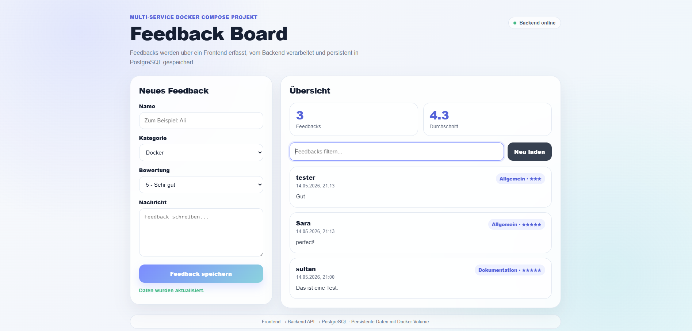

````markdown
# Feedback Board_C1 Auftrag

Eine moderne Multi-Service-Anwendung mit Frontend, Backend-API und PostgreSQL.  
Feedbacks werden über die API verarbeitet und persistent gespeichert.

---

## Vorschau



---

#  Multi-Service-Architektur mit Docker Compose

## 1. Was wurde umgesetzt?

Dieses Projekt ist eine kleine Feedback-Board-Anwendung. Benutzerinnen und Benutzer können im Browser Feedback mit Name, Kategorie, Bewertung und Nachricht erfassen. Das Frontend sendet die Daten an eine Backend-API. Das Backend validiert die Eingaben und speichert sie in einer PostgreSQL-Datenbank. Bereits gespeicherte Feedbacks werden wieder aus der Datenbank gelesen und im Frontend angezeigt.

Die Lösung wurde bewusst überschaubar gehalten, damit die Architektur nachvollziehbar bleibt. Trotzdem erfüllt sie die zentralen Anforderungen des Auftrags: mehrere Services, echte Kommunikation zwischen den Services, persistente Daten, Healthchecks, Restart-Policies, strukturierte Logs und getrennte Docker-Netzwerke.

---

## 2. Architektur

```text
┌──────────────┐
│   Browser    │
└──────┬───────┘
       │ HTTP
       ▼
┌──────────────┐
│ Frontend     │
│ Nginx        │
└──────┬───────┘
       │ /api/*
       ▼
┌──────────────┐
│ Backend API  │
│ Node.js      │
└──────┬───────┘
       │ SQL
       ▼
┌──────────────┐
│ PostgreSQL   │
└──────┬───────┘
       ▼
 Named Volume
````

---

## 3. Komponenten

### Frontend

Das Frontend besteht aus einer statischen HTML-Seite, die über Nginx ausgeliefert wird. Es handelt sich jedoch nicht um ein rein statisches Frontend. Die Anwendung kommuniziert aktiv mit dem Backend über die Endpunkte:

* `/api/feedback`
* `/api/stats`

Das Frontend lädt vorhandene Feedbacks dynamisch nach und kann neue Einträge speichern.

### Backend

Das Backend basiert auf Node.js und Express. Die API verarbeitet Requests, validiert Eingaben und kommuniziert mit der PostgreSQL-Datenbank.

Folgende Endpunkte werden bereitgestellt:

| Methode | Endpoint        | Zweck                                         |
| ------- | --------------- | --------------------------------------------- |
| GET     | `/health`       | Prüft Backend und Datenbankverbindung         |
| GET     | `/api/feedback` | Gibt alle Feedbacks zurück                    |
| POST    | `/api/feedback` | Speichert neues Feedback                      |
| GET     | `/api/stats`    | Gibt Anzahl und Durchschnittsbewertung zurück |

Das Backend schreibt strukturierte JSON-Logs nach stdout. Die Logs enthalten Zeitstempel, Log-Level, Service und Ereignis.

### Datenbank

Die Daten werden persistent in PostgreSQL gespeichert.

Verwendetes Named Volume:

```yaml
volumes:
  feedback_database_data:
```

Dadurch bleiben die Daten auch nach einem Neustart der Container erhalten.

---

## 4. Setup-Anleitung

### Voraussetzungen

* Docker
* Docker Compose
* Git

---

### Projekt starten

Linux / macOS:

```bash
cp .env.example .env
docker compose up --build
```

Windows PowerShell:

```powershell
copy .env.example .env
docker compose up --build
```

Danach ist die Anwendung erreichbar unter:

```text
http://localhost:8080
```

Backend-Healthcheck:

```text
http://localhost:3000/health
```

---

### Logs anzeigen

```bash
docker compose logs -f
```

Nur Backend-Logs:

```bash
docker compose logs -f backend
```

---

### Projekt stoppen

```bash
docker compose down
```

---

### Projekt inklusive Datenbankdaten löschen

```bash
docker compose down -v
```

---

## 5. Wichtige Konfiguration

Die Konfiguration erfolgt über Environment-Variablen.

Die Datei `.env.example` ist im Repository enthalten.
Die echte `.env`-Datei wird nicht versioniert und ist in `.gitignore` eingetragen.

Beispiel:

```env
POSTGRES_DB=feedbackdb
POSTGRES_USER=feedbackuser
POSTGRES_PASSWORD=example_password

BACKEND_PORT=3000
FRONTEND_PORT=8080
NODE_ENV=production
```

---

## 6. Architektur- und Docker-Entscheidungen

### Healthcheck und depends_on

Die Datenbank besitzt einen Healthcheck mit `pg_isready`.

Das Backend startet erst, wenn die Datenbank wirklich erreichbar ist:

```yaml
depends_on:
  database:
    condition: service_healthy
```

Das Frontend wartet wiederum auf ein gesundes Backend. Dadurch startet die Anwendung stabiler und reproduzierbarer.

---

### Netzwerke

Es werden zwei eigene Docker-Netzwerke verwendet:

```yaml
networks:
  frontend-network:
  backend-network:
```

Die Datenbank ist nur im Backend-Netzwerk erreichbar. Das Frontend kommuniziert nicht direkt mit der Datenbank. Dadurch bleibt die Architektur sauber getrennt.

---

### Restart-Policies

Alle Services verwenden:

```yaml
restart: unless-stopped
```

Wenn ein Service abstürzt, versucht Docker ihn automatisch neu zu starten. Sobald ein ausgefallener Service wieder verfügbar ist, funktioniert die Anwendung automatisch weiter.

---

## 7. Multi-Stage-Build

Das Backend verwendet einen Multi-Stage-Dockerfile.

Im ersten Schritt werden die Dependencies installiert, im zweiten Schritt wird nur die Runtime-Umgebung gebaut:

```dockerfile
FROM node:20-alpine AS dependencies
WORKDIR /app

COPY package.json package-lock.json* ./
RUN npm install --omit=dev

FROM node:20-alpine AS runtime
WORKDIR /app

COPY --from=dependencies /app/node_modules ./node_modules
COPY package.json ./
COPY src ./src

CMD ["npm", "start"]
```

Dadurch bleibt das finale Image kleiner und enthält nur die tatsächlich benötigten Dateien.

---

## 8. Strukturierte Logs

Das Backend schreibt Logs als JSON nach stdout.

Beispiel:

```json
{
  "timestamp": "2026-05-02T10:00:00.000Z",
  "level": "INFO",
  "service": "backend",
  "message": "Feedback created",
  "feedbackId": 1
}
```

Die Logs können mit folgendem Befehl angezeigt werden:

```bash
docker compose logs -f backend
```

---

## 9. KI-Deklaration

Zur Unterstützung wurden KI-Tools für einzelne technische Fragen, Formulierungen und kleinere Optimierungen verwendet.

Die finale Umsetzung, Konfiguration und Integration der Services wurden eigenständig angepasst, getestet und nachvollzogen. Der verwendete Code kann erklärt werden.


---

## 10. Reflexion

Im Projekt wurde deutlich, dass bei Docker Compose nicht nur einzelne Container wichtig sind, sondern vor allem das Zusammenspiel der Services.

Besonders wichtig waren:

* Healthchecks
* `depends_on`
* persistente Volumes
* getrennte Netzwerke
* strukturierte Logs
* Restart-Policies

Rückblickend könnte die Anwendung später noch erweitert werden, beispielsweise mit:

* Login-System
* automatisierten Tests
* CI/CD-Pipeline
* Container Registry
* Cloud-Deployment

Für diesen Auftrag wurde die Lösung jedoch bewusst kleiner gehalten, damit die technische Architektur klar verständlich bleibt und alle Anforderungen sauber umgesetzt werden.

```
```
README’ye aşağıdaki bölümü ekle. Bunu mevcut README’nin altına koyabilirsin.

# C2 · CI/CD mit GitHub Actions

## Ziel

Für C2 wurde eine automatische CI/CD-Pipeline mit GitHub Actions umgesetzt.
Bei jedem Push auf den Hauptbranch wird der Backend-Service automatisch getestet, als Docker-Image gebaut und in die GitHub Container Registry veröffentlicht.

Die bestehende Anwendung aus C1 wurde als Basis verwendet.

---

## Workflow-Übersicht

Die Pipeline besteht aus drei Stages:

```text
┌────────────┐
│ Git Push   │
└─────┬──────┘
      ↓
┌────────────┐
│ Test Stage │
│ npm test   │
│ npm lint   │
└─────┬──────┘
      ↓
┌────────────┐
│ Build      │
│ Docker     │
└─────┬──────┘
      ↓
┌────────────┐
│ Push GHCR  │
│ latest/SHA │
└────────────┘
```

Die Workflow-Datei befindet sich unter:

```text
.github/workflows/ci-cd.yml
```

---

## Verwendete Technologien

* GitHub Actions
* Docker Buildx
* GitHub Container Registry (GHCR)
* Node.js Test Runner
* Docker Layer Caching

---

## Test Stage

Im ersten Schritt wird der Backend-Code automatisch geprüft.

Folgende Befehle werden ausgeführt:

```bash
npm ci
npm test
npm run lint
```

Wenn Tests oder Linting fehlschlagen, wird die Pipeline sofort abgebrochen.

---

## Build Stage

Nach erfolgreichen Tests wird automatisch ein Docker-Image des Backend-Services gebaut.

Verwendet wird dabei der bestehende Multi-Stage-Dockerfile aus C1.

---

## Push Stage

Das fertige Image wird automatisch in die GitHub Container Registry veröffentlicht.

Repository:

```text
ghcr.io/sltnaksy/feedback_board-backend
```

---

## Tagging-Strategie

Die Images erhalten zwei Tags:

| Tag     | Zweck                          |
| ------- | ------------------------------ |
| latest  | aktuelle Version               |
| Git-SHA | eindeutige Nachvollziehbarkeit |

Beispiel:

```text
ghcr.io/sltnaksy/feedback_board-backend:latest
ghcr.io/sltnaksy/feedback_board-backend:a5cba6f
```

---

## Secrets und Sicherheit

Es werden keine Zugangsdaten im Repository gespeichert.

Die Pipeline verwendet den GitHub Actions Token:

```text
secrets.GITHUB_TOKEN
```

Die Authentifizierung zur Registry erfolgt zur Laufzeit automatisch.

---

## Caching

Die Pipeline verwendet Docker-Layer-Caching sowie npm-Caching.

Dadurch laufen wiederholte Builds ohne grosse Änderungen deutlich schneller.

---

## Trigger

Die Pipeline startet automatisch bei:

```yaml
push:
  branches:
    - main
```

Zusätzlich wurde `workflow_dispatch` aktiviert, damit der Workflow auch manuell gestartet werden kann.

---

## Reflexion

Durch C2 wurde deutlich, wie wichtig automatisierte Pipelines für reproduzierbare Builds sind.
Besonders hilfreich waren automatisierte Tests, Docker Buildx, Tagging-Strategien und das Arbeiten mit Container Registries.

Rückblickend könnte die Pipeline später noch um automatische Deployments oder Security-Scans erweitert werden.

---

## KI-Deklaration

Zur Unterstützung wurden KI-Tools für technische Fragen, Workflow-Strukturierung und Formulierungen verwendet.

Die finale Pipeline wurde eigenständig integriert, getestet und nachvollzogen.

//

# C3- Feedback Board – Cloud Deployment 

## Projektübersicht

Dieses Projekt ist eine cloudbasierte Feedback-Anwendung mit:

* einem Frontend-Service
* einem Backend-Service
* einer PostgreSQL-Datenbank

Die Anwendung ermöglicht es Benutzerinnen und Benutzern, Feedback über eine Weboberfläche und eine REST-API zu erstellen und abzurufen.

Das Projekt wurde im Rahmen des Auftrags C3 auf Railway deployt.

---

# Öffentliche URLs

## Frontend

```text
https://easygoing-trust-production-8bb2.up.railway.app
```

## Backend Health-Endpoint

```text
https://feedbackboard-production-a7e4.up.railway.app/health
```

Beispielantwort:

```json
{
  "status": "healthy",
  "service": "backend",
  "database": "reachable"
}
```

---
# Architektur

```text
                    ┌────────────────────┐
                    │      Frontend      │
                    │ Railway Service    │
                    │      (Nginx)       │
                    └─────────┬──────────┘
                              │ HTTP API Requests
                              ▼
                    ┌────────────────────┐
                    │      Backend       │
                    │ Railway Service    │
                    │    Node.js API     │
                    └─────────┬──────────┘
                              │ PostgreSQL Verbindung
                              ▼
                    ┌────────────────────┐
                    │     PostgreSQL     │
                    │ Managed Database   │
                    │      Railway       │
                    └────────────────────┘
```

---

# Repository

GitHub Repository:

```text
https://github.com/sltnaksy/feedback_board
```

---

# Deployment-Methode

Das Deployment ist vollständig reproduzierbar.

Jeder Push auf das GitHub-Repository löst automatisch ein neues Deployment auf Railway aus.

Der Ablauf:

```text
Git Push
→ Railway erkennt Änderungen
→ Docker Image Build
→ Container Deployment
→ Automatischer Neustart
→ Aktualisierung der öffentlichen Services
```

Dadurch ist kein manuelles Deployment notwendig.

---

# Services

## Backend-Service

### Root Directory

```text
backend
```

### Verwendete Technologien

* Node.js
* Express.js
* PostgreSQL
* Docker

### Funktionen

* REST API
* Health-Endpoint
* strukturierte Logs
* persistente PostgreSQL-Datenbank
* automatische Neustarts durch Railway

---

## Frontend-Service

### Root Directory

```text
frontend
```

### Verwendete Technologien

* HTML
* CSS
* JavaScript
* Nginx
* Docker

### Reverse Proxy Konfiguration

Das Frontend verwendet Nginx als Reverse Proxy.

Folgende Konfiguration war für Railway notwendig:

```nginx
proxy_pass http://feedbackboard.railway.internal:8080/api/;
```

Dadurch kann das Frontend intern mit dem Backend-Service kommunizieren.

---

## Datenbank-Service

### Datenbanktyp

Managed PostgreSQL-Datenbank von Railway.

### Persistenz

Die Datenbank verwendet persistente Speicherung.

Die Daten bleiben erhalten bei:

* Neustarts
* Redeployments
* Service-Restarts

Damit wird die Anforderung eines persistenten Datenspeichers erfüllt.

---

# Environment-Variablen

Sensible Daten sind nicht hardcoded im Repository gespeichert.

Alle Konfigurationen werden über Railway Environment-Variablen verwaltet.

## Backend Variablen

```text
NODE_ENV=production
PORT=3000
DB_HOST=${{Postgres.PGHOST}}
DB_PORT=${{Postgres.PGPORT}}
DB_NAME=${{Postgres.PGDATABASE}}
DB_USER=${{Postgres.PGUSER}}
DB_PASSWORD=${{Postgres.PGPASSWORD}}
```

Zusätzlich existiert eine:

```text
.env.example
```

Datei im Repository.

---

# Docker-Konfiguration

Sowohl Frontend als auch Backend werden mit Docker deployt.

## Backend

```text
backend/Dockerfile
```

## Frontend

```text
frontend/Dockerfile
```

Railway baut die Docker-Images automatisch während des Deployments.

---

# Logging

Das Backend erzeugt strukturierte Logs.

Beispiele:

```text
Database table is ready
Backend started
```

Die Logs können direkt im Railway Dashboard eingesehen werden.

Dadurch wird Debugging in der Cloud deutlich einfacher.

---

# Health-Endpoint

Das Backend stellt folgenden Endpoint bereit:

```text
/health
```

Der Endpoint überprüft:

* ob der Service läuft
* ob die Datenbank erreichbar ist

Beispielantwort:

```json
{
  "status": "healthy",
  "service": "backend",
  "database": "reachable"
}
```

---

# CI/CD Integration

Das Projekt enthält bereits eine CI/CD-Pipeline aus Auftrag C2.

Die Pipeline:

* baut Docker-Images
* validiert die Anwendung
* automatisiert den Build-Prozess

C3 erweitert das Projekt durch das öffentliche Cloud-Deployment.

---

# Setup-Anleitung

## Voraussetzungen

* GitHub Account
* Railway Account
* Docker (optional für lokale Tests)

---

## Deployment-Schritte

### 1. Repository klonen

```bash
git clone https://github.com/sltnaksy/feedback_board.git
cd feedback_board
```

---

### 2. Railway-Projekt erstellen

* Neues Railway-Projekt erstellen
* GitHub Repository verbinden

---

### 3. Backend deployen

Backend-Konfiguration:

```text
Root Directory: backend
```

Öffentliche Domain generieren.

---

### 4. PostgreSQL hinzufügen

Eine Railway PostgreSQL-Datenbank erstellen.

Railway erstellt die benötigten Credentials automatisch.

---

### 5. Environment-Variablen konfigurieren

Alle benötigten Variablen im Railway Dashboard setzen.

---

### 6. Frontend deployen

Frontend-Konfiguration:

```text
Root Directory: frontend
```

Öffentliche Domain generieren.

---

# Probleme und Lösungen

## Problem 1 – Backend Crash

### Ursache

Fehlende Datenbank-Variablen.

### Lösung

Folgende Railway-Variablen wurden ergänzt:

```text
DB_HOST
DB_PORT
DB_NAME
DB_USER
DB_PASSWORD
```

---

## Problem 2 – Frontend konnte Backend nicht erreichen

### Fehlermeldung

```text
host not found in upstream "backend"
```

### Ursache

Docker-Compose interne Hostnamen funktionierten in Railway nicht.

### Lösung

Die Nginx-Konfiguration wurde angepasst:

```nginx
proxy_pass http://feedbackboard.railway.internal:8080/api/;
```

---

# Sicherheitsaspekte

Folgende Sicherheitsmassnahmen wurden umgesetzt:

* keine Secrets im GitHub Repository
* Nutzung von Environment-Variablen
* automatisches HTTPS durch Railway
* managed PostgreSQL-Datenbank
* internes Railway-Netzwerk zwischen Services

---

# Reflexion und Learnings

Während dieses Projekts habe ich gelernt:

* wie PaaS-Plattformen funktionieren
* wie Cloud-Deployments mit Docker umgesetzt werden
* wie Railway internes Networking verwendet
* wie Frontend und Backend in der Cloud kommunizieren
* wie managed PostgreSQL-Datenbanken integriert werden
* wie automatische Deployments nach Git-Push funktionieren
* wie strukturierte Logs beim Debugging helfen

Die grösste Herausforderung war die Kommunikation zwischen Frontend und Backend innerhalb des Railway-Netzwerks.

Wenn ich das Projekt erneut umsetzen würde, würde ich:

* das Service Discovery verbessern
* die Environment-Konfiguration optimieren
* zusätzliche automatisierte Tests integrieren
* erweitertes Monitoring hinzufügen

---

# Deklaration KI-Nutzung

Für dieses Projekt wurden KI-Tools verwendet für:

* Troubleshooting
* Deployment-Unterstützung
* Dokumentation
* Konfigurations-Erklärungen

Alle Änderungen wurden überprüft und verstanden.

---

